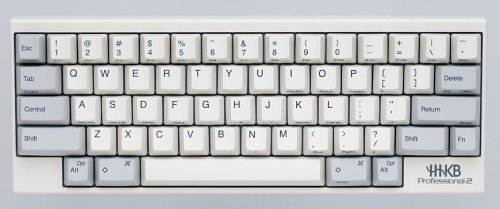
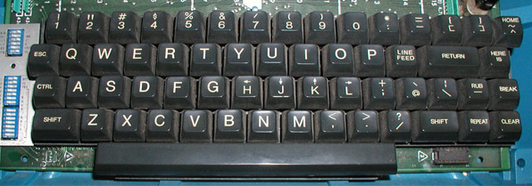
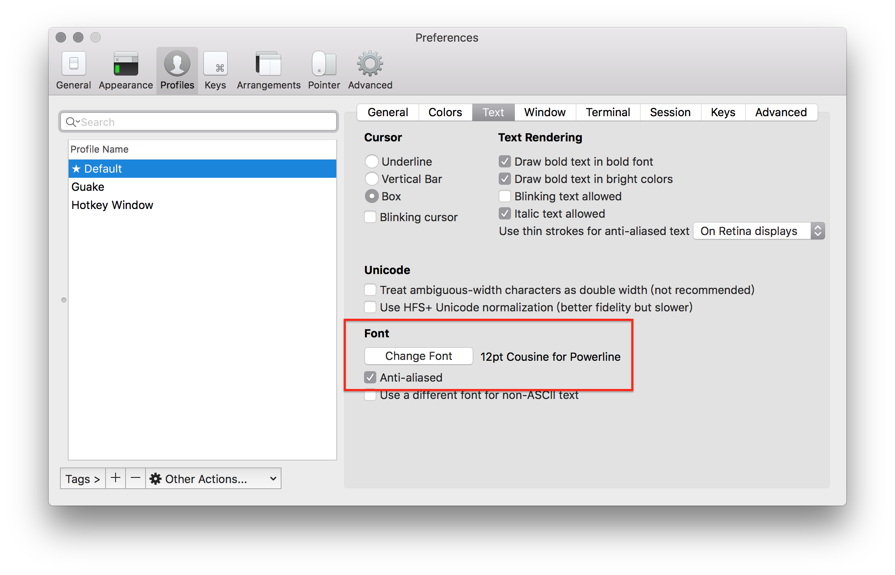
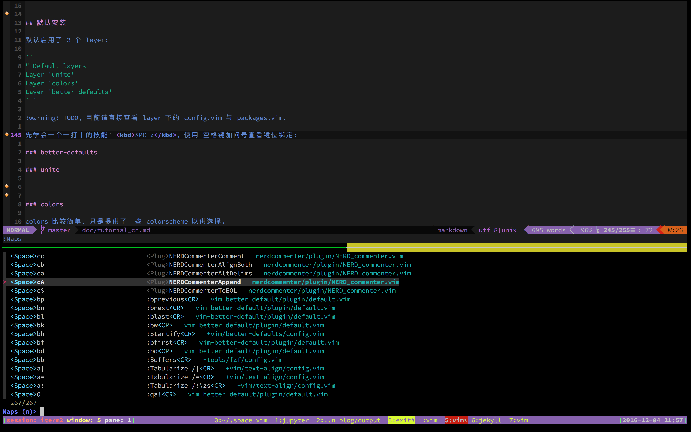

**Table of Contents**

<!-- vim-markdown-toc GFM -->
* [前言](#前言)
    * [几个概念](#几个概念)
    * [为什么使用空格键与 hjkl](#为什么使用空格键与-hjkl)
* [如何使用 space-vim](#如何使用-space-vim)
    * [准备工作](#准备工作)
        * [一个满足 “需求” 的 vim](#一个满足-需求-的-vim)
        * [额外所需的工具](#额外所需的工具)
        * [安装字体](#安装字体)
    * [如何启用 layer](#如何启用-layer)
    * [如何个性化](#如何个性化)
    * [如何更新](#如何更新)
* [默认安装](#默认安装)
    * [better-defaults](#better-defaults)
    * [unite](#unite)
    * [colors](#colors)

<!-- vim-markdown-toc -->

## 前言

### 几个概念

首先来了解一些概念，在 layers 目录有一些以 "+" 开头的子目录，比如 +lang，我们可以称之为 topic, 在该 topic 下会有一些 “真正” 的 layer.


```
├── +lang
│   ├── c-c++
│   ├── graphviz
│   ├── html
│   ├── markdown
│   └── python
├── +themes
│   ├── airline
│   └── colors
├── +tools
│   ├── fzf
│   └── ycmd
├── +version-control
│   ├── git
│   └── github
├── +vim
│   ├── better-defaults
│   ├── programming
│   └── text-align
└── LAYERS.md
```

以 +lang 为例，下面有 c-c++, python, markdown 等等一些子目录，这些就是我们真正在配置文件 .spacevim 可以用 `Layer 'python'` 这样的命令进行加载的 layer. 每个 layer 下一般有两个 “标准” 文件：

- packages.vim

    支持该 layer 所需的一些插件。在加载插件时，可能会有特殊的配置，比如 lazy-loading, 这也是插件管理器 [vim-plug](https://github.com/junegunn/vim-plug) 支持的特性之一。

- config.vim

    针对该 layer 的配置信息。比如针对 python, html 有不同的缩进等。

    此外, **每个 layer 下，通常附有一个 README 以简要说明，请在启用该 layer 时进行查阅**。


    ```
    ├── c-c++
    │   ├── README.md
    │   ├── config.vim
    │   └── packages.vim
    ├── markdown
    │   ├── README.md
    │   ├── config.vim
    │   └── packages.vim
    └── python
        ├── README.md
        ├── config.vim
        └── packages.vim
    ```

### 为什么使用空格键与 hjkl

space-vim 的前缀键设置为空格键， 来源于 spacemacs. 当然了，在 spacemacs 之前就已经有很多人这么设置了。spacemacs 除了外观漂亮，社区驱动等等优点，使用 evil 并用空格键作为其前缀键可能也是其中一个成功的卖点，因为真的可以减轻手指负担，毕竟 “触手可及”.

```vim
let g:mapleader="\<Space>"
```

从现代键盘设计的角度看，空格键理应受到优待, 毕竟一个人在 “VIP” 区占了好几个位. 即使 HHKB 这样的神器，也有空格键的一席之地.



此外，关于 vim 自身的键位设定，开始时能会觉得很奇怪为什么会这样，因为以前的键盘长这样:




看到这个，也就应该能够理解为什么 vim 使用 hjkl 作为方向键，因为物理条件就是这样, 没得选. 参见 [why-vim-uses-hjkl-as-arrow-keys](http://www.catonmat.net/blog/why-vim-uses-hjkl-as-arrow-keys/).

## 如何使用 space-vim

### 准备工作

又想马儿跑，又要马儿不吃草，那是不太现实的，所以要想要 space-vim 的体验好一些，一些准备工作必不可少:

#### 一个满足 “需求” 的 vim

所谓需求，是指有些插件要求 vim 必须拥有某项特性，比如 ycmd layer 中使用的 [YouCompleteMe](https://github.com/Valloric/YouCompleteMe) 要求 vim 得有 python 支持。

terminal 中输入 `vim --version`, 可以看到一串信息，下面显示的是我使用 brew 安装的 vim, 带 "+" 说明该 feature 有了， 带 "-" 说明没有，比如下面的 +python 说明支持 python3. 安装时还是保险一点，什么 lua, python 都装上, 以免后患。

```vim
$ vim --version
VIM - Vi IMproved 8.0 (2016 Sep 12, compiled Nov 21 2016 17:35:16)
MacOS X (unix) version
Included patches: 1-94
Compiled by Homebrew
Huge version without GUI.  Features included (+) or not (-):
+acl             +file_in_path    +mouse_sgr       +tag_old_static
+arabic          +find_in_path    -mouse_sysmouse  -tag_any_white
+autocmd         +float           +mouse_urxvt     -tcl
-balloon_eval    +folding         +mouse_xterm     +termguicolors
-browse          -footer          +multi_byte      +terminfo
++builtin_terms  +fork()          +multi_lang      +termresponse
+byte_offset     -gettext         -mzscheme        +textobjects
+channel         -hangul_input    +netbeans_intg   +timers
+cindent         +iconv           +num64           +title
-clientserver    +insert_expand   +packages        -toolbar
+clipboard       +job             +path_extra      +user_commands
+cmdline_compl   +jumplist        +perl            +vertsplit
+cmdline_hist    +keymap          +persistent_undo +virtualedit
+cmdline_info    +lambda          +postscript      +visual
+comments        +langmap         +printer         +visualextra
+conceal         +libcall         +profile         +viminfo
+cryptv          +linebreak       -python          +vreplace
+cscope          +lispindent      +python3         +wildignore
+cursorbind      +listcmds        +quickfix        +wildmenu
+cursorshape     +localmap        +reltime         +windows
+dialog_con      +lua             +rightleft       +writebackup
+diff            +menu            +ruby            -X11
+digraphs        +mksession       +scrollbind      -xfontset
-dnd             +modify_fname    +signs           -xim
-ebcdic          +mouse           +smartindent     -xpm
+emacs_tags      -mouseshape      +startuptime     -xsmp
+eval            +mouse_dec       +statusline      -xterm_clipboard
+ex_extra        -mouse_gpm       -sun_workshop    -xterm_save
+extra_search    -mouse_jsbterm   +syntax
+farsi           +mouse_netterm   +tag_binary
system vimrc file: "$VIM/vimrc"
user vimrc file: "$HOME/.vimrc"
2nd user vimrc file: "~/.vim/vimrc"
user exrc file: "$HOME/.exrc"
defaults file: "$VIMRUNTIME/defaults.vim"
fall-back for $VIM: "/usr/local/share/vim"
Compilation: clang -c -I. -Iproto -DHAVE_CONFIG_H   -DMACOS_X_UNIX  -g -O2 -U_FORTIFY_SOURCE -D_FORTIFY_SOURCE=1
Linking: clang   -L. -L/usr/local/lib  -L/usr/local/lib -o vim        -lm  -lncurses -liconv -framework Cocoa  -L/usr/local/lib -llua -fstack-protector  -L/System/Library/Perl/5.18/darwin-thread-multi-2level/CORE -lperl  -L/usr/local/opt/python3/Frameworks/Python.framework/Versions/3.5/lib/python3.5/config-3.5m -lpython3.5m -framework CoreFoundation  -lruby.2.0.0 -lobjc
```

#### 额外所需的工具

这里的工具，比如语法检查时用到的各种 linter, python 代码格式化时用到的 yapf。具体这些工具如何安装，以后再表。

#### 安装字体

要想漂亮，字体可能也是不可或缺。况且安装也不是很复杂。对于 airline layer 中使用的 [vim-airline](https://github.com/vim-airline/vim-airline) 最好搭配 [powerline fonts](https://github.com/powerline/fonts) 字体， space-vim 默认不使用. 不过推荐安装:

```vim
git clone https://github.com/powerline/fonts.git ~/.fonts
sh ~/.fonts/install.sh
```

powerline font 安装完成后，在 .spacevim 中启用字体：

```vim
let g:airline_powerline_fonts=1
```

需要注意的是设置 terminal 字体：

GUI 环境下可直接在 vim 字体可在配置文件进行设置. 终端环境下 vim 的字体服从于 terminal 的字体设置，因此安装完成后需要在 terminal 的字体设置中将原有字体改为带有 for powerline 样式的字体，否则可能会出现状态栏乱码. 比如 iterm2 中字体设置：




### 如何启用 layer

启用 layer 非常简单，使用一键安装脚本安装 space-vim 时会自动在当前用户目录下生成一个 `.spacevim`，可在其中的 `UserInit()` 部分进行启用, 也可以在里面放置 space-vim 没有的插件：

```vim
function! UserInit()
    " Put the layers you want to enable as well as extra private plugins

    Layer 'fzf'
    Layer 'ycmd'
    Layer 'syntax-checking'

    Layer 'emoji'
    Layer 'goyo'

    Layer 'html'
    Layer 'python'
    Layer 'markdown'
    Layer 'c-c++'

    Plug 'tpope/vim-fugitive'
    Plug 'junegunn/vim-github-dashboard'

endfunction
```

:warning: 注意，启用 layer 后，需要重新加载 .vimrc 执行 `:PlugInstall` 安装该 layer 涉及的相关插件。

### 如何个性化

在 `.spacevim` 中， 有个 `UserConfig()`，可以将一些个人的设置放置在这里。比如想换个主题：

```vim
function! UserConfig()

    color molokai

endfunction
```

如果个性化配置比较多，也可以放在 private 目录下。private 可看做是一个 layer, 里面可以有 config.vim 与 packages.vim 这两个文件。如果这两个文件存在，space-vim 也会在启动时进行加载。

### 如何更新

对于插件的更新，自然是通过 vim-plug提供的相关命令。对于 space-vim, 可以进入 "~/.space-vim" 执行 `git pull`, 后期可能会提供更加人性化的方式。


## 默认安装

默认启用了 3 个 layer:

```
" Default layers
Layer 'unite'
Layer 'colors'
Layer 'better-defaults'
```

:warning: TODO, 目前请直接查看 layer 下的 config.vim 与 packages.vim.

先学会一个一打十的技能：<kbd>SPC ?</kbd>, 使用 空格键加问号查看键位绑定:



从图中可以看到键位映射，比如挑一个 <Leader>bp, 对应的命令为 `:bprevious<CR>`, 意为 buffer previous, 跳转前一个 buffer. 后面还跟着定义该快捷键的文件, 来自 “vim-better-default/plugin/default.vim”。  

图中可以看出我正在 tmux 中使用 vim, 如果不是，那么执行这个操作的窗口会比较大，不要惊讶。

### better-defaults

### unite


### colors

colors 比较简单，只是提供了一些 colorscheme 以供选择.
